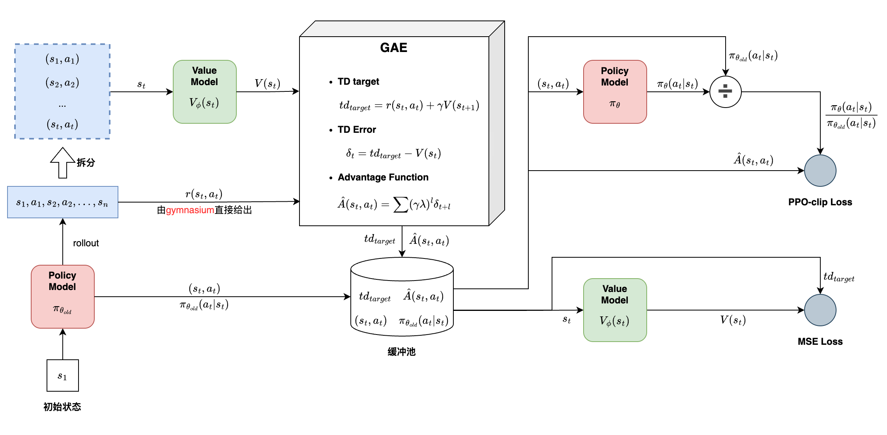
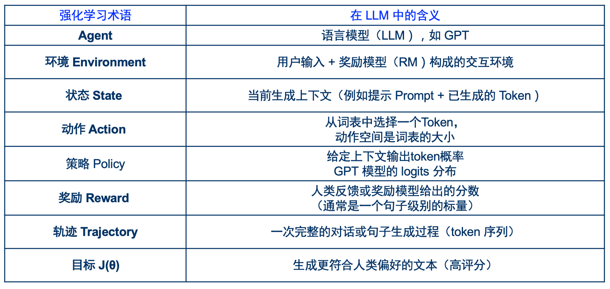

# PPO

# 一、`作业4`代码精读

## 整体架构



## 1.1 rollout

给定一个初始状态$s_1$，生成一个$\tau$ (`trajectory`):

$$
s_1 - a_1 \to s_2 - a_2 \to \dots \to s_n
$$

```python
state, _ = env.reset()  # 初始状态 s_1
while not done:
    action = agent.take_action(state) # 根据当前状态 s_t，采取某个动作 a_t
    next_state, reward, terminated, truncated, _ = env.step(action)  # 新的状态 s_t+1
    done = terminated or truncated  # 判断是否终止
```

## 1.2 reward

计算$r(s_t, a_t)$
```python
next_state, reward, terminated, truncated, _ = env.step(action)  # 奖励值 r_t
```

## 1.3 缓冲池

### 1.3.1 $(s_t, a_t)$

- 示例代码为了简化，执行一次rollout，更新一次缓冲池
- 即字典`transition_dict`

```python
transition_dict = {'states':[], 'actions':[], 'next_states':[], 'rewards':[], 'dones':[]}
state, _ = env.reset()  # Gymnasium 返回 (state, info)
done = False
while not done:
    action = agent.take_action(state)
    next_state, reward, terminated, truncated, _ = env.step(action)  # Gymnasium 返回5个值
    done = terminated or truncated  # 判断是否终止
    transition_dict['states'].append(state)
    transition_dict['actions'].append(action)
    transition_dict['next_states'].append(next_state)
    transition_dict['rewards'].append(reward)
    transition_dict['dones'].append(done)
    state = next_state
```

### 1.3.2 $\pi_{\theta_{old}} (a_t|s_t)$

```python
old_log_probs = torch.log(self.actor(states).gather(1,actions)).detach()
```

### 1.3.3 $td_{target}、\hat{A}(s_t, a_t)$

- 使用`GAE`来计算Advantages:
    1. $td_{target} = r(s_t, a_t) + \gamma V(s_{t+1})$
    2. **TD error**: $\delta_t = td_{target} - V(s_t)$
    3. 计算Advantages: $\hat{A}(s_t, a_t) = \sum (\gamma \lambda)^l \delta_{t+l}$

```python
td_target = rewards + self.gamma * self.critic(next_states) * (1 - dones)
td_delta = td_target - self.critic(states)
advantage = rl_utils.compute_advantage(self.gamma, self.lmbda, td_delta)

# compute_advantage定义如下
def compute_advantage(gamma, lmbda, td_delta):
    advantage_list = []
    advantage = 0.0
    for delta in td_delta[::-1]:
        advantage = gamma * lmbda * advantage + delta
        advantage_list.append(advantage)
    advantage_list.reverse()
```

## 1.4 重要性采样

> 准备一次**缓冲池数据**，计算很昂贵。如何有效利用呢？

### 1.4.1 原理

为了提高利用率，即**准备一次数据，可用来训练多个epoch**。  
引入了`重要性采样`技术：  
$$
使用\frac {\pi_{\theta} (a_t|s_t)} {\pi_{\theta_{old}} (a_t|s_t)} \hat{A}(s_t, a_t)，来近似真正的A(s_t, a_t)
$$

### 1.4.2 裁剪

但这个近似存在限制：$\pi_{\theta_{old}} (a_t|s_t)$ 与 $\pi_{\theta (a_t|s_t)}$ 不能相差过大。  
于是PPO中对这个近似，做了进一步裁剪：
$$
\min \left\{ \frac {\pi_\theta (a_t|s_t)} {\pi_{\theta_{old}} (a_t|s_t)} \hat{A}(s_t, a_t), \quad clip \left( \frac {\pi_\theta (a_t|s_t)} {\pi_{\theta_{old}} (a_t|s_t)}, 1-\varepsilon, 1+\varepsilon \right) \hat{A}(s_t, a_t) \right\}
$$

- 使用裁剪后的结果，来近似真正的 $A(s_t, a_t)$

```python
for _ in range(self.epochs):
    log_probs = torch.log(self.actor(states).gather(1, actions))
    ratio = torch.exp(log_probs - old_log_probs)
    surr1 = ratio * advantage
    surr2 = torch.clamp(ratio, 1 - self.eps, 1 + self.eps) * advantage  # 截断
    surr = torch.min(surr1, surr2)
```

## 1.5 actor-critic架构

> 一切准备就绪后，我们就可以通过**actor-critic架构**来训练`policy model`、`value model`  
> 具体实现方式，是同时优化这两个loss:

### 1.5.1 policy gradient loss

$$
PGLoss = - \frac 1 T \sum\limits_{(s_t, a_t)} \min \left\{ \frac {\pi_\theta (a_t|s_t)} {\pi_{\theta_{old}} (a_t|s_t)} \hat{A}(s_t, a_t), \quad clip \left( \frac {\pi_\theta (a_t|s_t)} {\pi_{\theta_{old}} (a_t|s_t)}, 1-\varepsilon, 1+\varepsilon \right) \hat{A}(s_t, a_t) \right\}
$$

> loss通常是求最小值，所以这里最前面添加了一个`负号`

```python
actor_loss = torch.mean(-torch.min(surr1, surr2))
```

### 1.5.2 value function loss

$$
VFLoss = \frac 1 T \sum\limits_{s_t} \left[ V_\phi(s_t) - td_{target} \right]^2
$$

> 这里的实现，与`trl`库`PPOTrainer`的实现，略有差异。
>
> 相当于采用`时序差分(TD)`的方法来训练`value model`:
>    - 直接使用$td_{target}$来作为`value model`的预测目标。

```python
critic_loss = torch.mean(F.mse_loss(self.critic(states), td_target.detach()))
```

## 1.6. KL惩罚项

> 读完代码，基本理解**PPO**的完整流程了。  
> 还剩最后一项：**KL惩罚项**，可以参考文末那篇博客。

# 二、RL for LLM

## 2.1 基本概念

1. 准备好一个**input**，即**强化学习**中的一个 状态(`state`)，生成下一个`token`，即**强化学习**中的一个 动作(`action`)
2. 一个**prompt**，生成一个**response**，对应**强化学习**中的一个 轨迹$\tau$ (`trajectory`)
    - $ s_1 - a_1 \to s_2 - a_2 \to \dots \to s_n $

    |语言模型中的概念|强化学习中的概念|
    |---|---|
    |**prompt**作为**input**|$s_1$|
    |生成下一个`token`|$a_1$|
    |**input**+已生成的`token` = 新的**input**|$s_2$|
    |继续生成下一个`token`|$a_2$|
    |...|...|
    |**prompt** + **response**|$s_n$|

## 2.2 总结

有了前面的介绍后，就可以理解老师的这张表格了



# 三、`trl`库中的`PPOTrainer`

> 至此，我们已经掌握了这些内容：
>    1. 理解简化版的PPO
>    2. 熟悉LLM中，对应RL的一些概念

基本就可以看懂这篇博客了：https://newfacade.github.io/notes-on-reinforcement-learning/17-ppo-trl.html