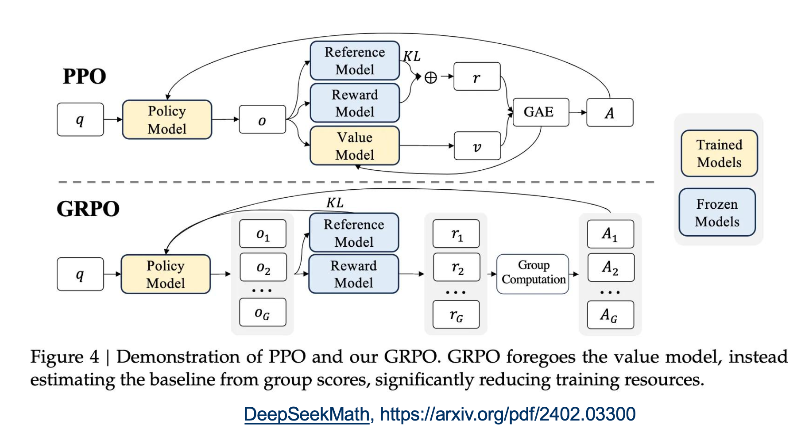
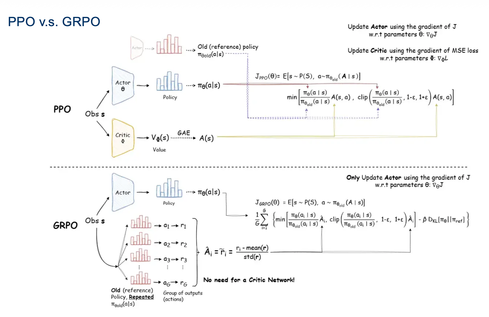

# 强化学习

> 下学期还有专门的**强化学习**课程，慢慢来

# 一、基本概念

## 1.1 MDP五元组

## 1.2 强化学习的目标

## 1.3 Q函数、V函数

> **Q(s,a)**: 处于状态s时，采取动作a，能够获得的期望奖励。  
> **V(s)**: 处于状态s时，能够获得的期望奖励

## 1.4 贝尔曼方程

#### 1) 从这张图来看，更直观：

> 上图中使用的奖励值为：$R_s^a=E[r_t|s_t=s, a_t=a]$  
> 与课件中的$R_{ss'}^a$，所代表的含义有差异。

#### 2) 贝尔曼最优方程

## 1.5 几种强化学习算法

# 二、优化算法

## 2.1 策略梯度

进一步，$r_{sa}$可以用$Q^{\pi_\theta}(s,a)$替代：

### 2.1.1 $Q^{\pi_\theta}(s,a)$

**蒙特卡洛法来近似**：  
利用累计奖励值$G_t$作为$Q^{\pi_\theta}(s,a)$的无偏采样。

### 2.1.2 $\pi_\theta(a|s)$

> **使用softmax随机策略**  
> 这部分没看懂，略

## 2.2 Actor-Critic

### 2.2.1 AC（Actor-Critic）

### 2.2.2 A2C（Advantageous Actor-Critic）

> 添加一个baseline，使用优势函数$A(s,a)$来代替**AC**中的$Q(s,a)$

### 2.2.3 A3C（Asynchronous Advantage Actor Critic）

> 这部分没看懂，略

## 2.3 TRPO

- todo

## 2.4 PPO

> 课件中简单介绍了PPO的几个知识点，  
> `作业4`给了一份示例代码，非常值得精读。  

专门总结一篇：[PPO](人工智能原理/学习/PPO.md)

## 2.5 GRPO

> 学习完**PPO**，两张图就可以解释清楚**GRPO**

1. 计算Advantage的方式

> 1. **PPO**理论更完备，使用`GAE`来估算。
>    - `GAE`需要准备好$r、v$
>    - 为了得到$v$，需额外引入`value model`
> 2. **GRPO**通过一些简化操作来近似。
>    - 每次准备一批$r_1, r_2, \dots, r_G$
>    - 直接这样近似计算：
>    $$
>    A_i = r_i - \frac {r_1 + r_2 + \dots + r_G} G
>    $$

2. 训练架构

> 1. **PPO**中，需训练两个模型`policy model`、`value model`
>    - 使用`actor-critic架构`来训练
> 2. **GRPO**简化之后，只需训练`policy model`
>    - 更像单纯的`policy gradient`

