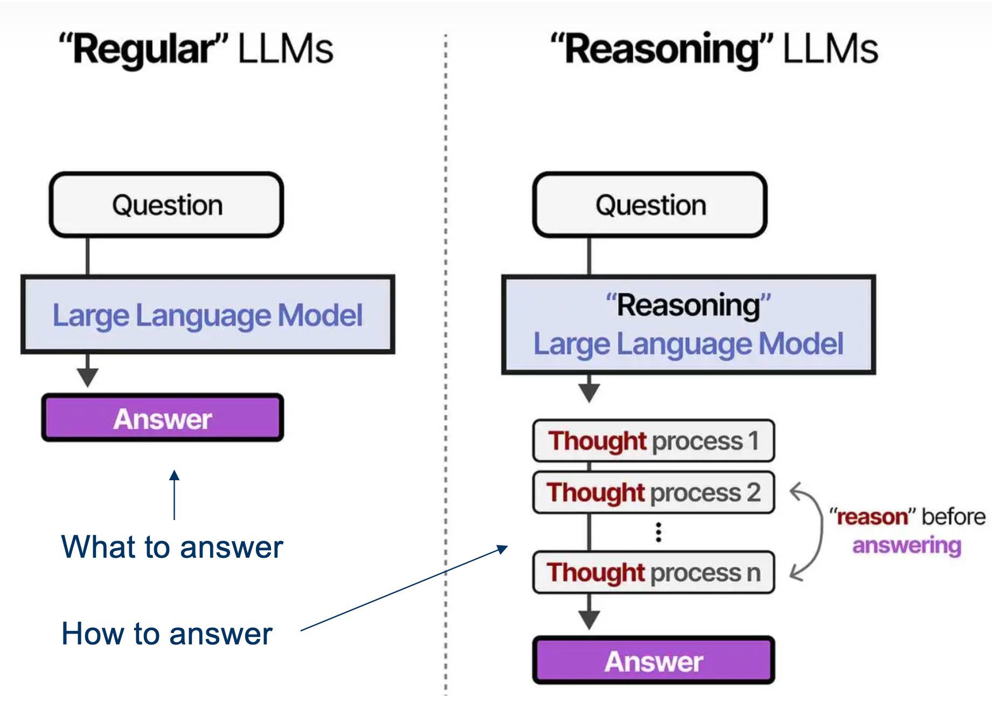
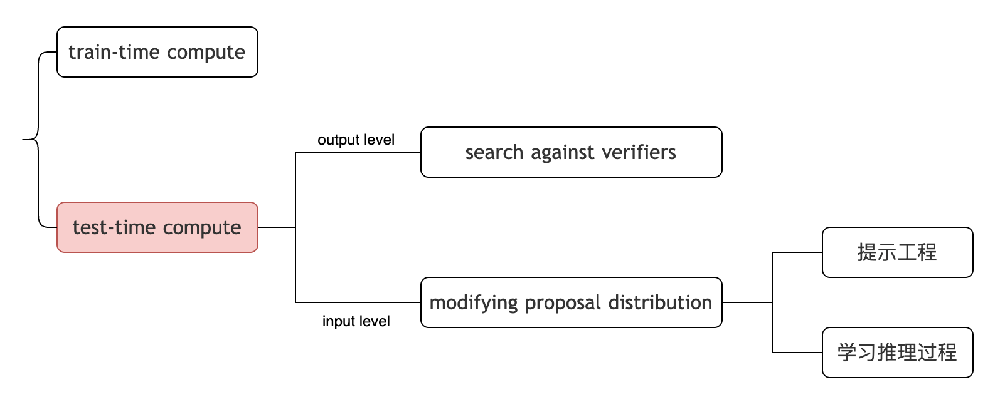
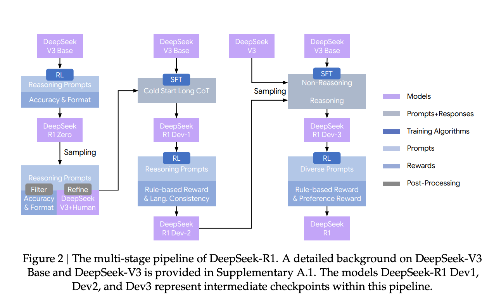

# 大模型推理

# 一、什么是`推理大模型`

> 1. 常规的LLM，直接输出答案
> 2. 推理的LLM，先输出思考过程，再给出答案

# 二、如何构建`推理大模型`

> 那么如何让模型具有`推理能力`？

- 先介绍了一些概念：

    

- 其中的`test-time compute`，就是为了让模型在推理过程中**多思考一会儿**
    - 也就是具有`推理能力`

## 2.1 search against verifiers

> **LLM**已固定，每次让模型生成多个答案，并挑选最佳答案。

- 几种选取策略：
    1. Majority Voting（多数投票）
    2. Best-of-N（选择打分最高的）
    3. beam search
    4. MCTS

## 2.2 modifying proposal distribution

### 2.2.1 提示工程

**CoT**: 在大模型的输入，即`prompt`中，添加**思考过程**。

### 2.2.2 学习`推理过程`

使用带有`推理过程`的数据集，对模型做微调。  

具体实例：<b>DeepSeek-R1</b>

> 主要使用了两种技术，让模型具有`推理能力`
>    1. **SFT**: 使用带有`推理过程`的数据集，对模型做微调。
>    2. **RL**：在`prompt`中指定格式，`reward`中添加`format reward`，竟然可以激发模型的`推理行为`。
>
> 详细流程，老师PPT也给出了：  
> 参考这篇博客：https://newsletter.maartengrootendorst.com/p/a-visual-guide-to-reasoning-llms

---

# 三、额外内容

> 讲到了**DeepSeek**，顺便介绍了一下**DeepSeek**的几大创新

1. PPO --> GRPO
2. FFN --> MoE
3. MHA --> MLA