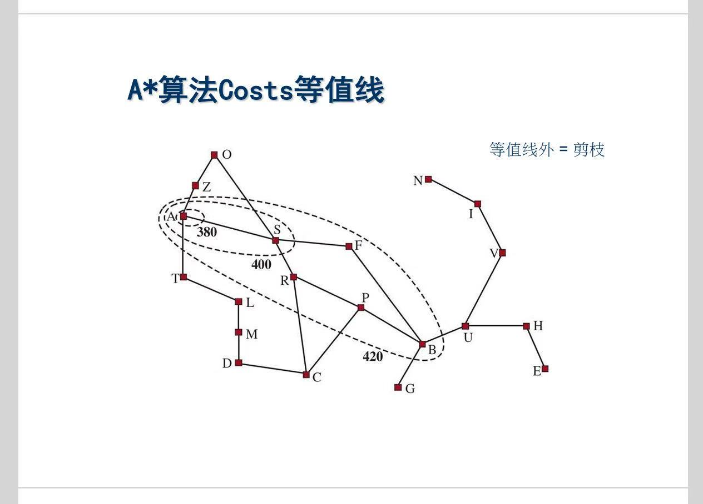

# 启发式搜索

**无信息搜索**，是一种盲目搜索。  
**启发式搜索**，则是希望利用特定信息，提高搜索效率。

> 例如**路径规划问题**  
> 给定一个路径图后，我们可以计算出每个节点到目标节点的直线距离  
> 这个信息就可以帮助我们有效地去探索

---

# pre、启发函数

- 定义： 启发函数 $h(n)$ = 从节点n到目标节点的最低耗散估计值
- 示例：
    ||$h(n)$|
    |---|---|
    |**路径规划问题**|节点n到目标节点的直线距离|
    |**八数码问题**|不在位的棋子数|
    |**八数码问题**|所有棋子到目标位置的距离之和|

# 一、贪婪最佳优先搜索

> 只利用 估计值（启发函数）

1. 定义一个**评价函数**：$f(n) = h(n)$
2. 有了**评价函数**，搜索策略就很简单：
    - 每次搜索时，选择**评价函数**最低的节点
    - 跟着老师给的实例过一遍，就明白了。~~这里略~~

# 二、$A^*$ 搜索

> 利用 真实已知信息 + 估计值

1. 定义一个**评价函数**：$f(n) = g(n)+h(n)$
    - 其中 $g(n)$ 为实际路径耗散
    - **路径规划问题**中，也就是实际走过的路程。
2. 每次搜索时，选择**评价函数**最低的节点
    - 跟着老师给的实例过一遍，就明白了。~~这里略~~

# 三、启发函数

## 3.1 可采纳性

- 定义：如果一个启发函数 $h(n)$ ，从来不过高地估计从**节点n**到**目标节点**的路径耗散，这个 $h(n)$ 就是`可采纳的`
- 结论：如果 $h(n)$ 是`可采纳的`，使用这个启发函数的 $A^*$ 算法 就是`完备`、`最优`的

## 3.2 一致性

> 比`可采纳性`要求更严格，满足`一致性`的启发函数，一定满足`可采纳性`

- 定义：一个启发函数满足以下条件，就具有`一致性`
    $$
    \begin{cases}
    h(n_i) \le h(n_j) + c(n_i, n_j) & n_j是n_i的后继节点，c(n_i, n_j)表示n_i到n_j的路径耗散 \\
    h(G) = 0 & G是目标节点
    \end{cases}    
    $$
- 结论：如果 $h(n)$ 具有`一致性`，就能保证 $f(n)$ 非递减。证明如下：
    $$
    \begin{aligned}
    f(n_i) &= g(n_i) + h(n_i) & f(n)的定义 \\
    & \le g(n_i) + h(n_j) + c(n_i, n_j) & 一致性 \\
    &= [g(n_i) + c(n_i, n_j)] + h(n_j) \\
    &= g(n_j) + h(n_j) \\
    &= f(n_j) & f(n)的定义
    \end{aligned}
    $$

沿着任意路径走下去，$f(n)$ 都是非递减的，于是就可以画出这样的等值线：

- $A^*$ 算法会探索等值线内的所有节点
- 等值线外的，均被剪枝

---
> 就整理这么多吧  
> 很多地方老师都是一带而过，简单了解就ok