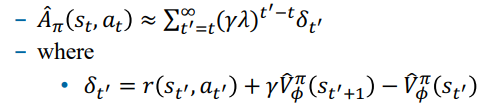

# ActorCritic架构

# 一、介绍

> 我们学习了用神经网络来拟合V(s)、Q(s,a)  
> 也学习了用神经网络来拟合$\pi(a|s)$  
> 将两者结合起来，就得到了**ActorCritic架构**

- 对应这部分内容

    

# 二、Actor

- 回忆[PolicyGradient](强化学习/PolicyGradient.md)中的**高方差问题**，两个解决思路：
    1. 利用`因果关系`，计算t时刻的$r(\tau)$时，做一些简化
        - 正好对应我们的Q(s,a)
    2. 引入`baseline`
        - 正好对应我们的V(s)

- 于是**Actor**部分的优化目标就可以改写为：
$$
\begin{aligned}
\nabla_\theta J(\theta) &= E_{\tau \sim \pi_{\theta}(\tau)} \left[ \sum\limits_{t=1}^T \nabla_\theta \log \pi_\theta(a_t|s_t) r(\tau) \right] \\
&= E_{\tau \sim \pi_{\theta}(\tau)} \left[ \sum\limits_{t=1}^T \nabla_\theta \log \pi_\theta(a_t|s_t) \big[Q_\pi(s_t,a_t) - V_\pi(s_t)\big] \right] \\
&= E_{\tau \sim \pi_{\theta}(\tau)} \left[ \sum\limits_{t=1}^T \nabla_\theta \log \pi_\theta(a_t|s_t) A_\pi(s_t,a_t) \right] \\
\end{aligned}
$$

# 三、Critic

> 接下来的问题，我们如何预测$A_\pi(s_t,a_t)$呢？

$$
\begin{align*}
A_\pi(s_t,a_t) &= Q_\pi(s_t,a_t) &- V_\pi(s_t) \\
&= r(s_t,a_t) + V_\pi(s_{t+1}) &- V_\pi(s_t) \tag{1}
\end{align*}
$$

- 用神经网络来拟合V(s)，即可

# 四、回合制 --> 持续制

- 在连续型任务上，$p_\theta(s,a)$收敛到一个平稳分布
- 我们不需要每个`时间步t`都单独计算了，优化目标可以改写为:
$$
\begin{align*}
\nabla_\theta J(\theta) &= E_{(s,a) \sim p_{\theta}(s,a)} \left[ \nabla_\theta \log \pi_\theta(a|s) A_\pi(s,a) \right] \\
&= E_{(s,a)} \bigg[ \nabla_\theta \log \pi_\theta(a|s) \big[Q_\pi(s,a) - V_\pi(s)\big] \bigg] \\
&= E_{(s,a)} \bigg[ \nabla_\theta \log \pi_\theta(a|s) \big[r(s,a) + V_\pi(s') - V_\pi(s)\big] \bigg] &与(1)式对应 \\
&= E_{(s,a)} \bigg[ \nabla_\theta \log \pi_\theta(a|s) \big[r(s,a) + \gamma V_\pi(s') - V_\pi(s)\big] \bigg] &！！但是需添加\gamma因子 \tag{2}
\end{align*}
$$

# 五、Advantage的更多优化

> 再来回顾一下(1)式，跟我们学过的`TD err`完全一样

- 于是我们也可以借鉴n-step、TD($\lambda$)，修改`TD target`部分，来优化**Advantage**
    - 在`偏差`/`方差`之间做**tradeoff**
    - 例如将`target`替换为$\lambda$-return，经过一系列推导后，可以表示为:

        
        > 其实，这就是我们**PPO**中使用的`GAE`