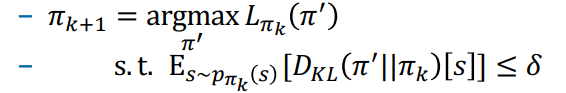
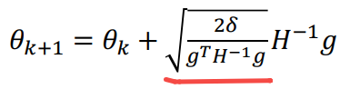

# ActorCritic系列

> 之前的**PolicyGradient**中，我们都是在`参数空间`里求解  
> 但是`参数空间`$\neq$`策略空间`  
> 接下来这部分，开始探讨如何在`策略空间`中求解

# 一、替代目标函数

1. 之前我们的优化目标是: $\max\limits_\theta J(\theta)$
2. **NPG**、**TRPO**中，优化目标修改为: $\max\limits_{\theta'} J(\theta')-J(\theta)$
    - 当两个策略很接近($D_{KL}<\delta$)时， 可以进一步推导出:
    $$
    L_{\pi_\theta}(\pi_{\theta'}) = E_{(s,a) \sim \pi_\theta} \left[ \frac {\pi_{\theta'}(a|s)} {\pi_{\theta}(a|s)} A_{\pi_\theta}(s,a) \right]
    $$
- 于是我们的目标变成了一个 带约束的优化问题:
    
    

# 二、NPG（Natural Policy Gradient）

- **NPG**中对`目标函数`一阶泰勒展开，对`KL散度约束`二阶泰勒展开
- 直接算出一个**解析解**:

    
    > $g$就是**梯度**，表示`在参数空间中的更新方向`  
    > $H$是**Hessian矩阵**，$H^{-1}g$表示`在策略空间中的更新方向`  
    > 红线部分，是学习率$\alpha$，会根据$g、H$动态调整

# 三、TRPO

> 但是$H^{-1}$很难计算，**TRPO**通过一些技巧来高效求解

1. 共轭梯度法
2. 回溯线搜索

# 四、PPO

> **PPO**中直接抛弃了$H^{-1}$，更简单粗暴

- 直接限制新旧策略的概率比率 $\frac {\pi_{\theta'}(a|s)} {\pi_{\theta}(a|s)}$
