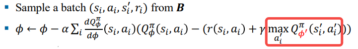

# DDPG（Deep Deterministic Policy Gradient）

# 一、DQN

- 我们暂时回到这部分内容

    

> 我们之前学习**Q-learning**的时候，用的**表格法**  
> 后来又学习了可以用神经网络来拟合Q(s,a)  
> 两者结合，就得到了**DQN**

## 1.1 replay buffer

- 打破数据间的相关性

## 1.2 target network

- 使用**参数暂时固定**的目标网络，来解决`半梯度优化`问题

## 1.3 Double DQN

- 同**Double Q-learning**

## 小结

- **DQN**证明了“`深度网络` + `经验回放` + `目标网络`”在强化学习中是可行的

- 但是**DQN**只能处理`离散动作`

    
    > 因为这里需要遍历所有动作，找最大值

# 二、DDPG（Deep Deterministic Policy Gradient）

- 继续探讨这部分内容

    

> **DQN**只能处理`离散动作`，**DDPG**可以处理`连续动作`

## 2.1 DPG（Deterministic Policy Gradient）

- 在[PolicyGradient](强化学习/PolicyGradient.md)中，我们学习了**策略梯度定理**
    - 使用随机策略$\pi_\theta$采样出的数据，可以求解出$\nabla_\theta J(\theta)$
- **确定性策略梯度定理**告诉我们
    - 使用确定性策略$\mu_\theta$采样出的数据，也可以求解出$\nabla_\theta J(\theta)$

> 于是我们可以把**ActorCritc**中的随机策略$\pi_\theta$，替换成确定性策略$\mu_\theta$

## 2.2 DDPG

- **DQN**证明了“`深度网络` + `经验回放` + `目标网络`”在强化学习中是可行的
    - `深度网络`是对`Q(s,a)`的拟合，只有一个网络$Q_\phi(s,a)$
    - 跟Q-learning一样，使用**贝尔曼最优方程**求解
- **DDPG**则使用了`ActorCritic`架构
    - `深度网络`有两个
        1. Actor: 确定性策略$\mu_\theta(s)$
        2. Critic: $Q_\phi(s,a)$
    - 使用**策略迭代**求解

> - 处理`连续动作`的关键：$\mu_\theta$
>    - 动作空间虽然是无限的，但是可以通过神经网络$\mu_\theta$，输出一个确定的动作
