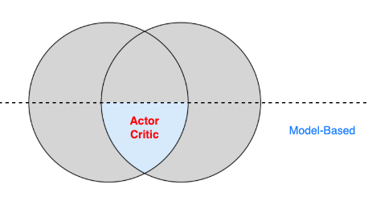
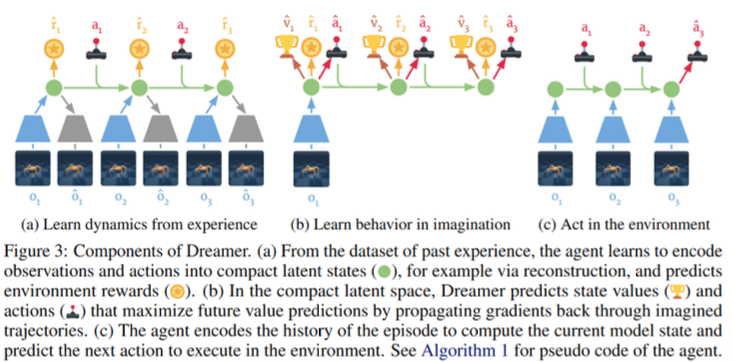

# Dreamer系列

# 一、介绍

> 直接学习一个**全局模型**太难了  
> **GPS**去学习一个局部模型，**Dreamer系列**则是去`隐空间`中学习
> - 思想跟上学期[生成式模型](人工智能原理/学习/生成式模型.md)中学习的**Latent Diffusion Model**类似  
>   - 在原始的图像空间扩散，算力要求高。于是转换到`Latent`去扩散

- 对应这部分内容

    

# 二、RSSM

- 在低维的`隐空间`中学习**dynamics**
    - 根据当前的$h_t、s_t、a_t$预测$h_{t+1}、s_{t+1}$
    - 根据当前的$h_t、s_t$预测$r_t$

# 三、PlaNet

- 首次提出**RSSM**
- 需要做决策时，在`隐空间`去plan

# 四、Dreamer

- 在**RSSM**基础上，加入了**ActorCritic**

> - 图a，在学习**dynamics**
> - 图b，在学习**ActorCritic**
