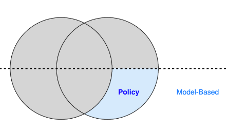
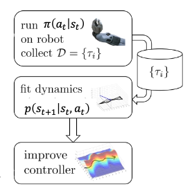
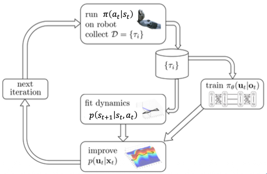

# GPS（Guided Policy Search）

# 一、介绍

> `Model-Free`部分基本学习完了，接下来看`Model-Based`  

> 直接学习一个**全局模型**太难了  
> 这章学习的**GPS**算法，通过学习一个**局部模型**，来优化我们的`policy`

- 对应这部分内容

    

# 二、传统的`最优控制`

> 类似于前面学习[动态规划](强化学习/动态规划.md)算法，如果已知**MDP**，可以求解出**Value Function**  
> 如果已知**MDP**，我们也可以使用**最优控制**，求解出最优的**动作序列**

## 2.1 LQR

如果`dynamic`是线性的，可以用**LQR**直接求解

## 2.2 iLQR

如果`dynamic`是非线性的，可以用**iLQR**来迭代求解

# 三、GPS

## 3.1 `局部模型`+`iLQR`

> 1. 跟环境交互，生成数据
> 2. 拟合一个`局部模型`
> 3. 利用`局部模型`的信息，运行`iLQR`，找出最优动作序列

## 3.2 policy

> 有了`iLQR`生成的最优动作，就可以来指导`policy`的更新

- 对于每个局部状态，使用`iLQR`生成最优动作，当作老师
    - 指导学生`policy`来学习
- 然后继续下一轮迭代，让模型学习下一个局部状态
    - 最终的`policy`，泛化到全局