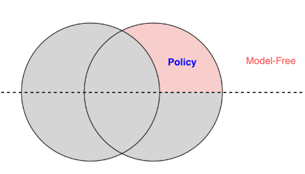
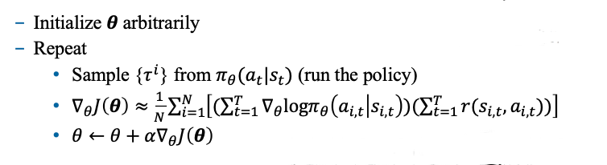

# PolicyGradient

# 一、介绍

> 之前我们学习了用神经网络来拟合V(s)、Q(s,a)  
> 现在学习用神经网络来拟合$\pi(a|s)$，将我们的策略，也**参数化**

- 对应这部分内容

    

# 二、目标函数

- 从某个分布$p_\theta$采样生成$\tau$，我们的目标是最大化这个：
$$
J(\theta) = E_{\tau \sim p_{\theta}(\tau)} [r(\tau)]
$$

# 三、策略梯度定理

- 我们的参数在$p_\theta$里，直接求导非常困难  
    - **策略梯度定理**，把求导问题转换为了`可以通过采样来估计的问题`：
$$
\nabla_\theta J(\theta) = E_{\tau \sim p_{\theta}(\tau)} [\nabla_\theta \log p_\theta(\tau) r(\tau)]
$$

- $p_{\theta}$由两部分构成：$p(s_{t+1}|s_t, a_t)$、$\pi_\theta(a_t|s_t)$，我们的$\theta$只跟策略$\pi_\theta(a_t|s_t)$有关
    - 经过一些推导，求导问题又可以转化为：
$$
\nabla_\theta J(\theta) = E_{\tau \sim \pi_{\theta}(\tau)} \left[ \sum\limits_{t=1}^T \nabla_\theta \log \pi_\theta(a_t|s_t) r(\tau) \right]
$$

# 四、REINFORCE

> 使用MC来估计我们的$r(\tau)$，就得到了最简单的PolicyGradient算法：**REINFORCE**

## 4.1 算法流程

## 4.2 与 监督学习 对比

> 更好地理解**强化学习**

1. 监督学习，是最大似然
    - 让我们见过的所有数据，概率最大化
2. 强化学习，则是给每条数据一个打分：$r(\tau)$
    - 分数高的，提升概率
    - 分数低的，降低概率

## 4.3 高方差问题

- 引入两个策略来改进
    1. 利用`因果关系`，计算t时刻的$r(\tau)$时，做一些简化
    2. 引入`baseline`

## 4.4 off policy

- 策略梯度法，很难直接应用
    - 每更新一次梯度，之前的采样数据就不能用了，需要重新采样
    - 使用**重要性采样**
- 仍然会存在`连乘问题`