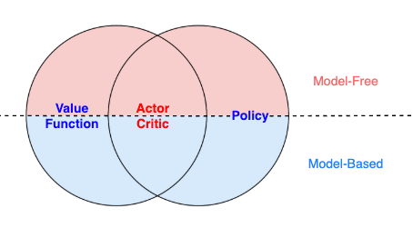
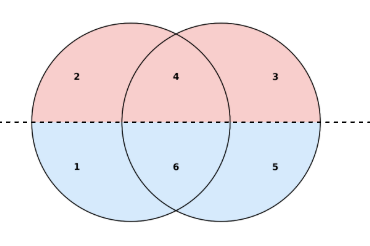

# 人工智能原理与应用

1. [基础概念](强化学习/基础概念.md)
    - 首先介绍了强化学习中的一些基础概念
2. 强化学习的分类
    
    

    

    
然后介绍了强化学习的分类，后面会按照这个顺序依次学习

    
    
    
    1. [动态规划](强化学习/动态规划.md)
    2. [蒙特卡洛 & TD](强化学习/蒙特卡洛&TD.md)
    - [Dyna](强化学习/Dyna.md)
    3. [PolicyGradient系列](强化学习/PolicyGradient系列.md)
    4. [ActorCritic](强化学习/ActorCritic.md)
    5. [GPS](强化学习/GPS.md)
    6. [Dreamer](强化学习/Dreamer.md)
    
    

    
3. [SAC](强化学习/SAC.md)
    - 从一个全新的视角来看`强化学习`
4. [逆强化学习](强化学习/逆强化学习.md)