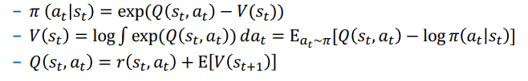
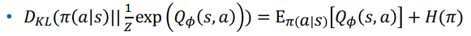

# SAC（Soft Actor Critic）

> 接下来，让我们从一个全新的视角来看**强化学习**  
> 会发现很多知识点都是相通的

# 一、VAE

1. 上节课**RSSM**中，**WordModel**的优化目标，就是**VAE**中的**ELBO**
2. **VAE**中的**Encoder**在做什么？
    - **变分推断**：真实的$p(z|x)$很难求，用一个简单的$q_\phi(z|x)$来近似

# 二、概率图模型

## 2.1 控制即推断

- 将**控制**问题，转化为**概率图模型**下的**推断**问题
    - **控制**: 寻找最优策略
    - **推断**: 在概率图中，推断最优轨迹的后验分布$p(\tau|O_{1:T})$

## 2.2 变分推断

### 2.2.1 目标函数

- 真实的后验分布$p(\tau|O_{1:T})$很难求，用一个简单的$q(\tau)$来近似
- 于是优化目标变成了**VAE**中的**ELBO**，推导后能够得出:
    $$
        \sum\limits_t E_{(s_t,a_t) \sim \pi} \bigg[ r(s_t,a_t) + H \big( \pi(a_t|s_t) \big) \bigg] 
    $$
    > - 在我们原来强化学习的目标上，增加了一项**动作的熵**
    > - 数学形式上，解决了$p(\tau|O_{1:T})$`过分乐观`的问题
    >   - 实际工程落地，往往需要再添加一个温度系数$\alpha$

### 2.2.2 优化问题的解

- 最终的解，由3个互相关联的部分组成:

    

# 三、soft Q-learning

- 原始的**Q-learning**中，涉及到$Q(s,a)、V(s)=\max\limits_a Q(s,a)$
- 使用**2.2.2**推导出的结论
    - 用`soft版的V(s)`代替原始的`V(s)`
    - $\pi(a|s)$也换成`soft版`
    - 就得到了**soft版的Q-learning**

# 四、soft Policy Gradient

- 原始的**Policy Gradient**，只涉及到$\pi(a|s)$
    - $\pi(a|s)$换成`soft版`，就得到了**soft版的Policy Gradient**
    - 它的优化目标也变成了**原始目标**+**动作的熵**
- 有一篇论文证明了，这本质上，是在最小化两个分布的KL散度

    

> 换个视角来看**强化学习**  
> **强化学习**其实就是在`对齐两个分布`

# 五、soft Actor Critic

- **Actor Critic**呢？
    - $Q(s,a)、V(s)、\pi(a|s)$都换成`soft版`
    - 就得到了**soft版的Actor Critic**