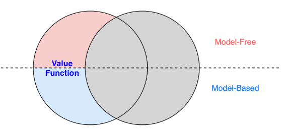
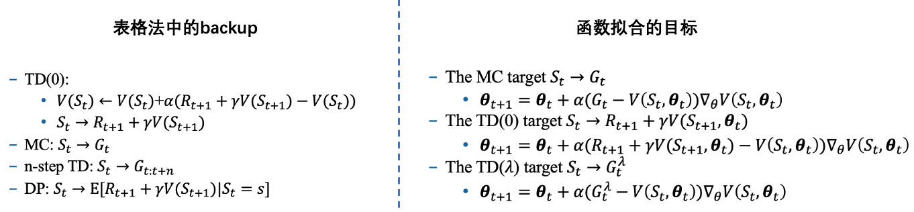
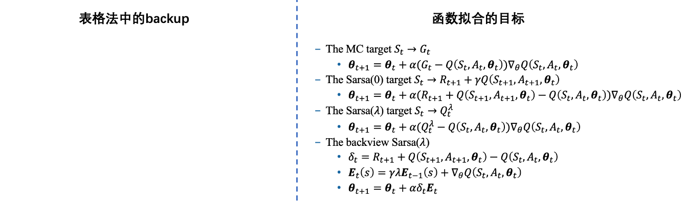

# ValueFunction的更多扩展

# 一、介绍

> 现在已经学习了**Value Function**相关内容，可以扩展出更多

- 对应这部分内容

    

# 二、model-based RL

> 我们不知道**真实环境**的**dynamics**，但是可以通过`监督学习`来建模  
> 构造出一个**虚拟环境**

## 2.1 分布模型

- 对整个**MDP**建模
    - 有了这个模型后，就可以用**动态规划**中的方法，在**虚拟环境**中`plan`

## 2.2 样本模型

- 只生成样本
    - 输入$S_t、A_t$，模型直接返回$S_{t+1}、R_{t+1}$
    - 有了这个模型后，就可以用**MC、TD**中的方法，在**虚拟环境**中`plan`

# 三、Dyna架构

> 更进一步，我们可以同时利用**真实环境**、**虚拟环境**

## 3.1 主要思想

1. 在**真实环境**中少量交互，生成一些**真实数据**
    - 使用**真实数据**来`学习`
2. 在**虚拟环境**中，成本更低，生成大量**模拟数据**
    - 使用**模拟数据**来`plan`

## 3.2 模型不正确时的影响

1. **真实环境**变差
    - agent可以自动纠正，探索出正确路径
2. **真实环境**变好
    - agent无法意识到 有更优路径
    - 解决办法：鼓励更多探索

## 3.3 如何提升效率？

### 3.3.1 prioritized sweeping

> 状态过多时，优先更新哪些状态？

### 3.3.2 sample update 

> 我们使用`期望值`来更新，还是`采样`后直接更新？
- 使用`期望值`更新，更准确，但消耗算力
- 当分支因子b比较大时，`采样`更新，效果也很好

### 3.3.3 trajectory sampling 

> 只更新那些 **当前策略能到达的状态**

---

#### 表格法 --> 神经网络

> 至此，我们已经学习完**表格化**的RL，它只能处理中小规模问题  
> 现实问题中，往往需要处理大规模的**状态**、**动作**  
> 怎么解决？ ---- **深度学习**: `使用神经网络来拟合 value function`

---

# 四、函数拟合

## 4.1 V(s)

> 使用**backup**操作中的`target`，来作为神经网络的`拟合目标`

## 4.2 Q(s,a)

> 类似地，也可以得出**Q函数**的`拟合目标`

## 4.3 收敛性

> 这节课老师重点介绍了使用**函数拟合**后，**收敛性**问题  
> ~~有点儿难，略~~

# 附：致命三元组

#### 1) 函数拟合

#### 2) bootstrapping

#### 3) off policy

off policy 带来的问题

1. **backup**操作中的`target`，或者神经网络的`拟合目标`，会发生变化
   - 即**target policy**与**behavior policy**的分布不一致
   - **重要性采样**
2. 引入**重要性采样**后，可能会导致`方差爆炸`

