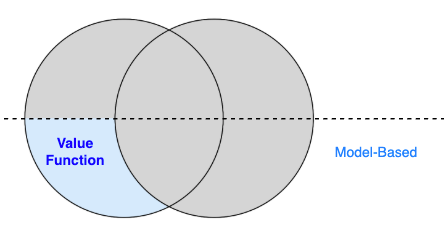
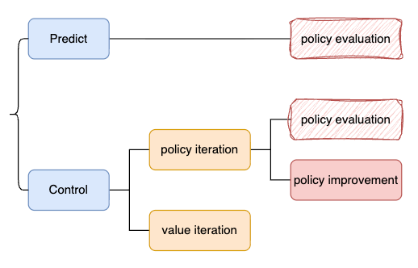

# 动态规划

# 一、介绍

> 首先考虑最简单的问题：  
> 假设我们已知**MDP**，也就是知道真实环境的**dynamic**，如何求解？

- 对应这部分内容

    

# 二、概要

## 2.1 强化学习中需要解决两个问题

1. **Predict**
    - 已知一个`policy`，如何计算它的`value`
2. **Control**
    - 如何找到最优的`policy`?

## 2.2 图示

## 2.3 动态规划 与 贝尔曼方程

1. 策略评估
    - 通过`贝尔曼期望方程`求解
2. 策略迭代
    - 迭代地使用 `贝尔曼期望方程`+`策略提升`
    - 最终达到了 `贝尔曼最优方程`
3. 值迭代
    - 通过`贝尔曼最优方程`求解