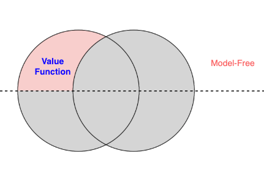
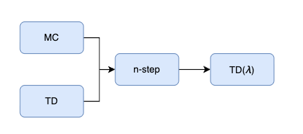
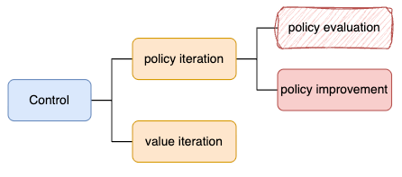

# 蒙特卡洛&TD

# 一、介绍

> 如果我们不知道**MDP**，不知道真实环境的**dynamic**，如何求解？

- 对应这部分内容

    

# 二、Predict

1. **n-step**是**MC**与**TD**的权衡
2. TD$(\lambda)$则是对每一个**n-step**进行加权求和
    - 理论上：`前向计算`版本
    - 工程实现上：可以改为`后向传播`版本 --- **资格迹**

# 三、Control

> - 主要思想
>   - **Predict**部分，我们是评估$V(s)$
>   - 在**Control**里，改为评估$Q(s,a)$

结合这个图来理解后面的几种算法：

## 3.1 MC Control

- policy iteration
    1. 策略评估：`蒙特卡洛`应用到$Q(s,a)$
    2. 策略提升：$\epsilon$-greedy

## 3.2 SARSA

- policy iteration
    1. 策略评估：`TD`应用到$Q(s,a)$
    2. 策略提升：$\epsilon$-greedy

## 3.1&3.2 补充

基于**policy iteration**，还可以衍生出更多版本

1. n-step control
    - `n-step` 应用到$Q(s,a)$
2. Sarsa($\lambda$)
    - TD($\lambda$) 应用到$Q(s,a)$

## 3.3 Q-learning

- value iteration
    - `贝尔曼最优方程`应用到$Q(s,a)$

补充

> - 目前的算法中都包含了**maximization**操作
>   - 会带来`maximization bias`
> - 解决办法：**Double Q-learning**中提出，使用两个$Q(s,a)$

## 3.* off policy

另外介绍了`on policy`与`off policy`的概念

以及`重要性采样`