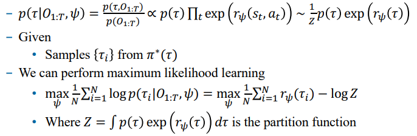
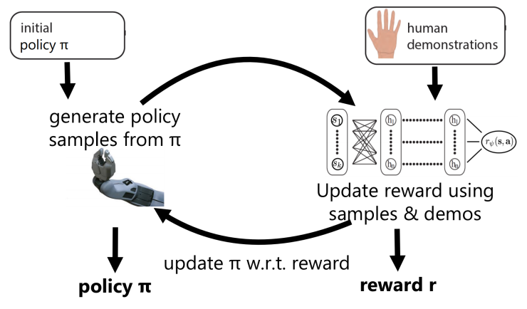
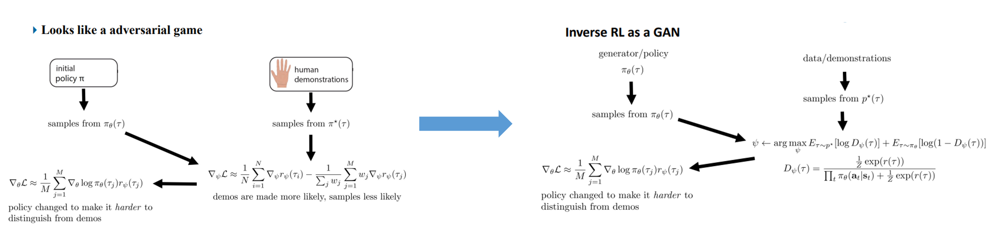

# 逆强化学习

> **强化学习**解决的问题是：已知reward，去寻找最优策略  
> 最后介绍了一点儿**逆强化学习**的知识：从专家策略中rollout，然后推断出reward

# 一、最大熵逆强化学习

1. 在**概率图模型**中，我们可以推断后验分布:
    $$
    p(\tau|O_{1:T}) \propto p(\tau) exp \left(\sum\limits_t r(s_t, a_t) \right)
    $$

2. 如果使用一个模型来拟合$r(s_t, a_t)$，即$r_\psi(s_t, a_t)$
    - 就可以用极大似然来学习参数$\psi$

        

> **梯度更新**的过程中，需要遍历所有(s,a)  
> 因此只能处理**表格化**问题

# 二、GCS（Guided Cost Learning）

> **最大熵逆强化学习**中需要遍历所有(s,a)  
> 怎么解决呢？ ---采样

# 三、逆强化学习 与 GAN

> **GCS**的框架跟**GAN**很像，于是我们可以重新构造一下目标函数  
> 使用**GAN**的方式来进行**逆强化学习**

