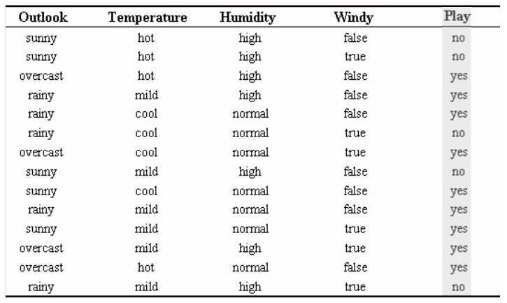

# 决策树

# 一、从`ID3`到`C4.5`

## 1.1 熵的概念
1. 物理学中的熵
    - 熵代表一个系统的混乱程度。系统越混乱，熵越大
2. 信息学中的熵
    - **自信息**：单一事件发生时所包含的信息量。一个随机事件$x$的自信息为：
        $$
        I(x) = - \log_2 p(x) \qquad p(x)为事件x发生的概率
        $$
        > 例如太阳从东方升起，概率为1。自信息$I(x) = - \log_2 1 = 0$，确定性事件，包含的信息量为0。这件事情发生，没有带来任何新信息。  
        > 明天下雨的概率为1/8。自信息$I(x) = - \log_2 \frac 1 8 = 3$。如果明天下雨了，带来的信息量很大

    - **熵**：所有可能事件的自信息的期望。一个离散随机变量$X$，其取值集合为$\{x_1,x_2,...,x_n\}$，那么$X$的熵为：
    $$
    H(X) = - \sum\limits_{i=1}^n p(x_i) \log_2 p(x_i)
    $$

## 1.2 决策树的构建
- 以该数据集为例，展示决策树的构建流程
    

### 1.2.1 `ID3`

<b>信息增益</b>

1. 训练样本由9个yes和5个no组成，随机变量**paly**的熵为：
$$
entropy([\frac 9 {14}, \frac 5 {14}]) = - \frac 9 {14} \log \frac 9 {14} - \frac 5 {14} \log \frac 5 {14} = 0.940bits
$$
2. 将训练样本，按**outlook**特征拆分为3份，示意图如下：

    

3. 计算每个叶结点对应的熵：
$$
entropy([\frac 2 5, \frac 3 5]) = - \frac 2 5 \log \frac 2 5 - \frac 3 5 \log \frac 3 5 = 0.971 bits \\
entropy([1, 0]) = - 1 \log 1 - 0 \log 0 = 0 bits \\
entropy([\frac 3 5, \frac 2 5]) = - \frac 3 5 \log \frac 3 5 - \frac 2 5 \log \frac 2 5 = 0.971 bits
$$
4. 于是就可以计算出，划分前后的**信息增益**：
$$
\begin{aligned}
gain(outlook) &= 0.940 - \underbrace{\left[ \frac 5 {14} * 0.971 + \frac 4 {14} * 0 + \frac 5 {14} * 0.971 \right]}_{叶结点熵的加权和} \\
&= 0.940 - 0.693 \\
&= 0.247 bits
\end{aligned}
$$

<b>构建流程</b>

1. 初始时只有一个根结点，对应所有训练样本
2. 遍历所有特征，对数据集进行划分，示意图如下：

    

3. 计算每种划分方式的**信息增益**：
$$
gain(outlook) = 0.247bits \\
gain(temperature) = 0.029bits \\
gain(humidity) = 0.152bits \\
gain(windy) = 0.048bits
$$

4. 选择**信息增益**最大的分裂方式，即使用**outlook**特征进行分裂，第一步分裂后的决策树如下：

    

5. 递归分裂：对每个叶结点，重复`2-4步`，直到满足停止条件

- 补充两个概念
    1. 上面计算过程中**叶结点熵的加权和**，也叫**条件熵**
        - outlook给定的条件下，随机变量**paly**的条件熵
    2. 所以**信息增益**的定义也可以这样表述:
        - **熵**与**条件熵**之差（一般称作**互信息**）
- 其他
    1. `ID3`只能处理**离散特征**  
    2. **信息增益**倾向于选择取值多的特征，`C4.5`针对这个问题，提出了**信息增益率**

### 1.2.2 `C4.5`

<b>信息增益率</b>

> **信息增益率** = **信息增益** / **分裂信息**
> 1. **信息增益**衡量特征A能为分类带来多少信息
> 2. **分裂信息**衡量特征A本身将数据集进行分裂的广度和均匀性
>    - 例如**ID特征**，取值很多且均匀分布，计算出来的**分裂信息**值就会很大

同样以上面的数据集为例，具体说明**信息增益率**的计算过程
1. 训练样本中，**outlook**特征的取值比例
    - sunny:overcast:rainy = 5:4:5
2. 计算**分裂信息**，与**熵**的计算类似：
$$
splitinfo([\frac 5 {14}, \frac 4 {14}, \frac 5 {14}]) = - \frac 5 {14} \log \frac 5 {14} - \frac 4 {14} \log \frac 4 {14} - \frac 5 {14} \log \frac 5 {14} = 1.577
$$
3. **信息增益率**：
$$
gainratio(outlook) = \frac {gain(outlook)} {splitinfo} = \frac {0.247} {1.577} = 0.157
$$

- 构建流程
    - 与**ID3**类似，只是将**信息增益**替换为**信息增益率**
- 其他
    1. 也可以处理**连续特征**，通过**二分法**将连续特征离散化  
    2. 引入剪枝
    3. 能够处理缺失值

# 二、CART（classification and regression tree）

> 前面介绍的两种为**多叉树**，CART为**二叉树**
> - 对于离散特征，通过问题“特征A是否属于某个子集？”来不断划分
> - 对于连续特征，通过问题“特征A是否 <= 某个阈值？”来划分

CART即可用于**分类**，也可用于**回归**任务。分别来介绍：

## 2.1 分类树

<b>基尼系数</b>

- 从数据集D中随机抽取两次样本，其类别标记不一致的概率
    - 值越小，数据集的纯度越高。
    - 也叫**基尼不纯度**
$$
\begin{aligned}
Gini(D) &= \sum\limits_{i=1}^m p_i \sum\limits_{j \ne i} p_j \\
&= \sum\limits_{i=1}^m p_i (1 - p_i) \\
&= \sum\limits_{i=1}^m p_i (1 - p_i) \\
&= \sum\limits_{i=1}^m p_i - \sum\limits_{i=1}^m p_i^2 \\
&= 1 - \sum\limits_{i=1}^m p_i^2
\end{aligned}
$$

<b>“基尼增益”</b>

- 类似于**信息增益**，计算“**基尼增益**”的流程如下：
1. 根结点的基尼系数：
$$
Gini([\frac 9 {14}, \frac 5 {14}]) = 1 - \left[ {\left( \frac 9 {14} \right)}^2 + {\left( \frac 5 {14} \right)}^2 \right] = 0.459
$$
2. 按**outlook**特征是否为sunny，划分为2份。计算每个叶结点的基尼系数：
$$
Gini([\frac 3 {5}, \frac 2 {5}]) = 1 - \left[ {\left( \frac 3 {5} \right)}^2 + {\left( \frac 2 {5} \right)}^2 \right] = 0.48 \\
Gini([\frac 2 {9}, \frac 7 {9}]) = 1 - \left[ {\left( \frac 2 {9} \right)}^2 + {\left( \frac 7 {9} \right)}^2 \right] = 0.346 \\
$$
3. 按**outlook**特征是否为sunny，划分前后的**基尼增益**：
$$
\begin{aligned}
GiniDelta(outlook, sunny) &= 0.459 - \underbrace{\left[ \frac 5 {14} * 0.48 + \frac 9 {14} * 0.346 \right]}_{叶结点基尼系数的加权和} \\
&= 0.459 - 0.394 \\
&= 0.065
\end{aligned}
$$

<b>构建流程</b>

1. 初始时只有一个根结点，对应所有训练样本
2. 遍历所有特征，每个特征，遍历切分点，计算相应的“**基尼增益**”：
$$
GiniDelta(outlook, sunny) = 0.065 \\
GiniDelta(outlook, overcast) = ... \\
GiniDelta(outlook, rainy) = ... \\
GiniDelta(humidity, high) = 0.0915 \\
GiniDelta(windy, true) = 0.0304 \\
GiniDelta(temperature, hot) = 0.016 \\
GiniDelta(temperature, mild) = ... \\
GiniDelta(temperature, cool) = ... \\
$$

3. 选择“**基尼增益**”最大的分裂方式，即使用**humidity**特征是否为high进行分裂
    - 注意这里与`ID3`中的分裂方式不同
4. 递归分裂：对每个叶结点，重复`2-3步`，直到满足停止条件

- 其他
    - 由于根结点的**基尼系数**固定，“**基尼增益**”最大，也就是**叶结点基尼系数的加权和**最小
    - 所以分类树的目标，是**基尼系数**最小

## 2.2 回归树

- 回归树的目标，是**平方误差**最小

<b>构建流程</b>

- 回顾下**分类树**

    1. 遍历所有特征，每个特征，遍历切分点，计算相应的“**基尼增益**”：
    $$
    GiniDelta(outlook, sunny) = 0.065 \\
    GiniDelta(outlook, overcast) = ... \\
    GiniDelta(outlook, rainy) = ... \\
    GiniDelta(humidity, high) = 0.0915 \\
    GiniDelta(windy, true) = 0.0304 \\
    GiniDelta(temperature, hot) = 0.016 \\
    GiniDelta(temperature, mild) = ... \\
    GiniDelta(temperature, cool) = ... \\
    $$
    2. 然后根据“**基尼增益**”来选择最优特征、以及该特征的最佳切分点

- **回归树**则是基于这个公式来选择（最优特征j，最佳切分点s）：
$$
\min_{j,s} \left[ \min_{c_1} \sum\limits_{x_i \in R_{left}(j,s)} (y_i - c_1)^2 + \min_{c_2} \sum\limits_{x_i \in R_{right}(j,s)} (y_i - c_2)^2 \right]
$$

# 三、一些停止条件（预剪枝）

1. 树的深度达到阈值
2. 结点内样本数少于阈值
3. 所有特征的分裂增益小于阈值

# 四、后剪枝
> 略