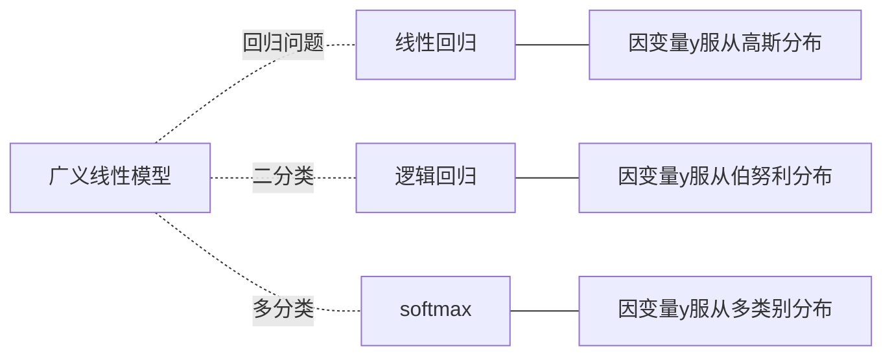

# 线性回归和逻辑回归

> 这节不整理笔记了

```mermaid
graph LR
    G[广义线性模型]
    G -.回归问题.- X[线性回归] --- N[因变量y服从高斯分布]
    G -.二分类.- L[逻辑回归] --- B[因变量y服从伯努利分布]
    G -.多分类.- S[softmax] --- M[因变量y服从多类别分布] 
```

- 都可以用概率论的知识来推导
    1. 假设因变量y服从某个分布，写出似然函数
    2. 最大似然估计，得到优化目标
    3. 梯度下降法，求解
