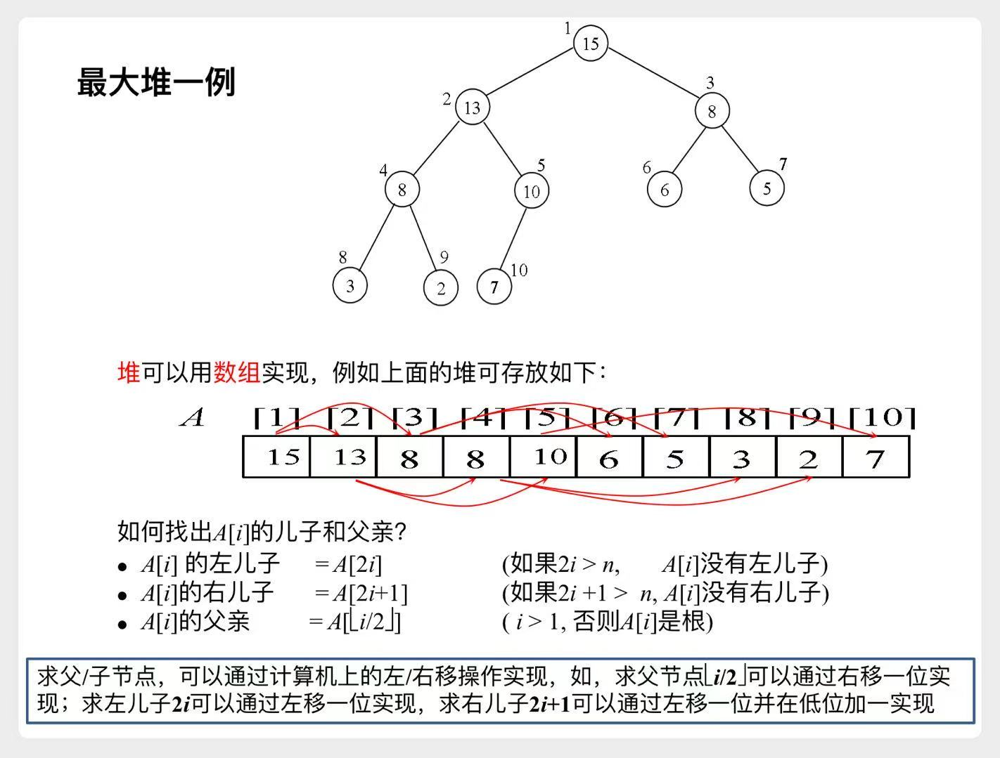
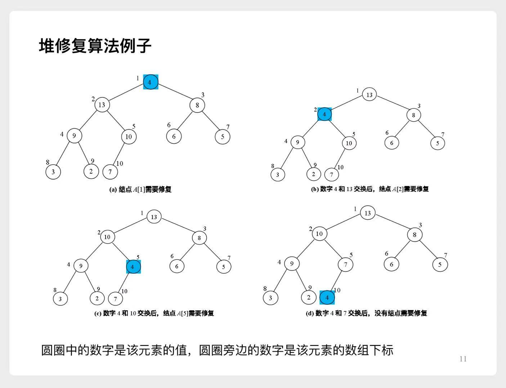
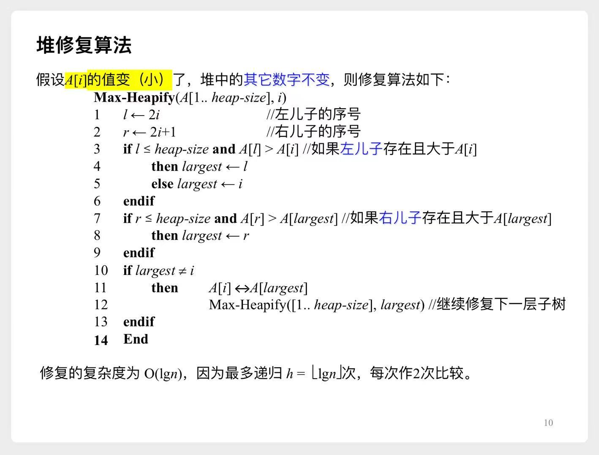
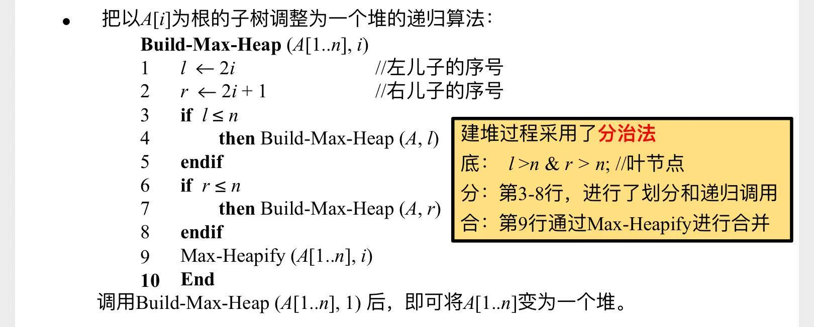
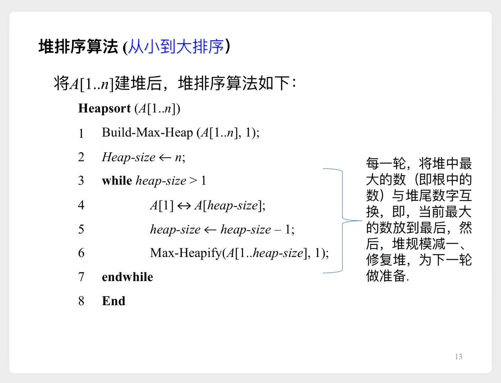

# 堆排序

## 一、堆的数据结构
- 逻辑结构: 完全二叉树
- 物理结构: 顺序存储

示意图

> 注意这里，数组A的下标是从`1`开始

## 二、堆排序使用到的几个函数
### 2.1 堆修复算法

图解

伪代码

复杂度分析

我们最多需要从根节点到某一个叶子结点。
- 假设初始位置在根节点
    - 递归一次，需要调整的位置来到第二层
    - 递归两次，需要调整的位置来到第三层
    - 递归h-1次（h为树的深度），需要调整的位置来到叶子结点，结束

又 $h=\lfloor \lg n \rfloor + 1$，因此最多需要递归 $\lfloor \lg n \rfloor$ 次  
每次递归，需要进行2次比较  
所以时间复杂度为 $O(\lg n)$

### 2.2 构建堆
有了前面的**堆修复算法**，可以很方便地来**构建堆**

伪代码

> 先将n个数字存入数组中，接下来调整位置就可以了，是一种**原地算法**  
> **分**：找到左、右子结点，先去构建左、右子树  
> **底**：到达叶结点时，什么都不需要做，已经建好了，直接返回即可  
> **合**：当左、右子树已经是`大顶堆`时，我们只需要调用上一节的**堆修复算法**，将根节点调整到合适位置即可

#### 复杂度分析
> 不妨设$n=2^{h+1}-1$，即**完美二叉树**

- 每次将规模为n的问题，划分为2个规模为n/2的问题
    - a=2, b=2
- 每次**合**的复杂度，即调用一次**堆修复算法**
    - $f(n) = O(\lg n)$
- 于是由**主方法**`规则1`：$T(n) = \Theta(n)$

### 2.3 堆排序

伪代码

> 这段代码很直观：
> 1. 构建一个**大顶堆**
> 2. 删掉堆顶元素，将堆的最后一个元素补充到堆顶，然后**修复堆**
> 3. 重复第2步，直到堆里只剩一个元素

- 很优雅地原地排序

## 三、堆的应用举例：优先队列
通过伪代码展示了优先队列的几个操作:
1. 提升某个节点的优先级
    - 一直往上找：若当前节点优先级>父节点优先级，就与父节点交换。
2. 插入新节点
    - 先在堆的末尾插入一个优先级为 $-\infty$ 的节点，再提升该节点的优先级
3. 取出优先级最大的节点
    - 即取出堆顶元素，将堆末尾的元素置顶，然后**修复堆**
4. 降低某个节点的优先级
    - PPT里没列举，直接**修复堆**即可