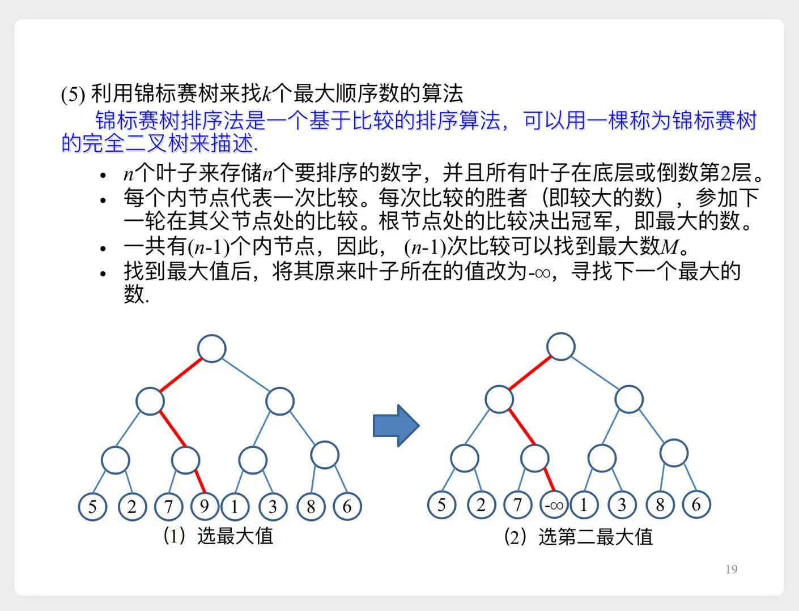

# top k

# 一、实际应用

1. 找出访问次数最多的前100个网站
2. 找出访问次数最多的前1000个视频
3. ...

# 二、各种算法比较

- 例如从 $10^9 \approx 2^{30}$ 个数字中，找出前 $1000 \approx 2^{10}$个

1. 重复1000次，每次找最大的数。大约需要`1000n`次
2. 回顾上一章，找出第1000顺序数。大约需要`60n`次（常数因子为60）。然后再遍历一遍，取出top1000
3. 归并排序，需要 $n \lg n \approx$ `30n`次（常数因子为1）。排好序后取出top1000
    - 归并排序需要 $\Omega(n)$ 的额外存储开销
4. 利用**小顶堆**
    1. 先取出k个数建**小顶堆**
    2. 遍历剩下的数，与堆顶元素比较
        1. 小于等于堆顶，丢弃
        2. 大于堆顶，取代堆顶元素，然后修复堆
    3. 最后堆中的k个数，即为topk
    - 每次修复堆，大约需要 $2 \lg k$ 次比较，所以共需要 $2n \lg k \approx$ `20n`次
5. 利用**大顶堆**
    1. 用这n个数建**大顶堆**，大约需要`2n`次比较
    2. 输出前k个最大数（堆排序的前k次循环），大约需要 $2k \lg n \approx$ `60000` <<n次
    - 缺点是 需要`n`的存储空间
6. **锦标赛树**
    - 比较过程类似于`小组赛`-->`八强`-->`四强`-->...
    - 示意图
        
    - 复杂度分析
        1. 第一次找最大数，需要比较`n-1`次（即从n个数中寻找最大数）
        2. 之后的每次比较，需要 $\lceil \lg n \rceil - 1$次（锦标赛树中的某一条路径）
        - 所以总共需要 $(n-1) + (k-1)(\lceil \lg n \rceil - 1) \approx $`n`次
    - 缺点是需要`2n-1`的存储空间（`n-1`个内结点 + `n`个叶结点）

