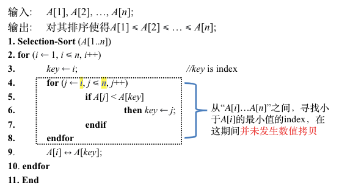
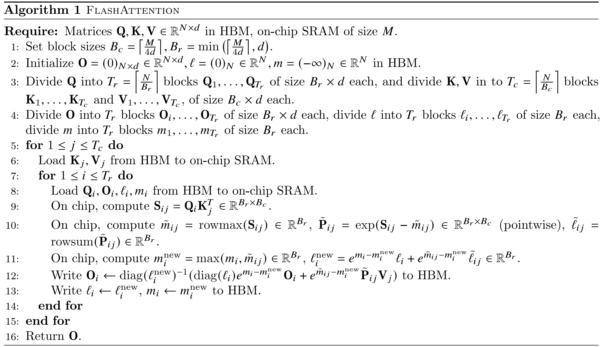
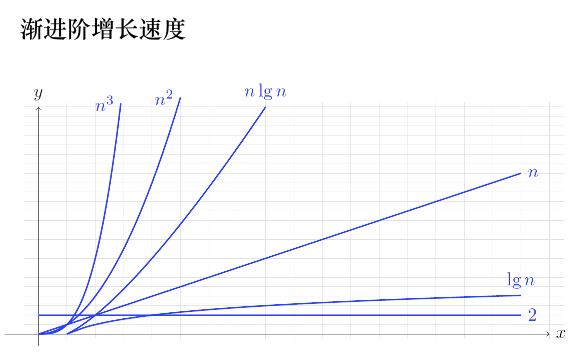

# 算法概论及分析

## 一、算法解决什么问题
1. 给定一个算法，如何分析其时间复杂度？
2. 给定一个问题，如何设计一个具有最小复杂度的算法？

<b>例：各种排序算法</b>

||平均时间复杂度|最坏时间复杂度|
|---|---|---|
|选择排序|$O(n^2)$|$O(n^2)$|
|冒泡排序|$O(n^2)$|$O(n^2)$|
|插入排序|$O(n^2)$|$O(n^2)$|
|希尔排序|$O(n \log n)$|$O(n^2)$|
|快速排序|$O(n \log n)$|$O(n^2)$|
|归并排序|$O(n \log n)$|$O(n \log n)$|
|堆排序|$O(n \log n)$|$O(n \log n)$|
|基数排序|$O(d(n+k))$|$O(d(n+k))$|
|...|||

## 二、算法如何表示 --> 伪代码

1. `选择排序`的两种伪代码表示
    

    
<b>示例1</b>

    

    

    

    
<b>示例2 (更为简洁，突出设计思路)</b>

    

    

2. 我们读论文时，也会看到很多伪代码。例如这篇[paper](https://arxiv.org/pdf/2205.14135)中:

    

    
<b>flash_attention</b>

    

    

## 三、算法复杂度分析

### 3.1 以`选择排序`为例，分析复杂度
- 回顾一下上面的第二节，选择排序的伪代码**示例2**，我们的主要操作在第3步:
    1. 从`{A[1], A[2], A[3], ..., A[n]}`中选出最小的数，需要进行`n-1`次比较
    2. 从`{A[2], A[3], ..., A[n]}`中选出最小的数，需要进行`n-2`次比较
    3. ...
    4. 从`{A[i], A[i+1], ..., A[n]}`中选出最小的数，需要进行`n-i`次比较
    5. ...
    6. 从`{A[n-1], A[n]}`中选出最小的数，需要进行`1`次比较
- 因此总共需要比较的次数为:
    $$
    \begin{aligned}
    T(n) &= (n-1) + (n-2) + ... + 1 \\
    &= \frac {n (n-1)} 2
    \end{aligned}
    $$

### 3.2 以`线性搜索`为例，介绍 最好、最差、平均情况
- 我们要在一个数组`{3, 9, 7, 6, 1, ..., 5, 13}`中查找一个特定数字
    1. 最好情况: 查找“3”，第一个数字就是。此时只需要进行`1`次比较
    2. 最差情况: 查找“13”，最后一个数字。此时只需要进行`n`次比较
    3. 最差情况: 查找“99”，在数组中没有。此时也需要进行`n`次比较
    4. 平均情况
        > 未简化计算，没考虑上面的第三种情况：查找“99”  
        
        |查找的数字|比较次数|查找该数字的概率|
        |---|---|---|
        |3|1|$\frac 1 n$|
        |9|2|$\frac 1 n$|
        |A[i]|i|$\frac 1 n$|
        |13|n|$\frac 1 n$|
        - 因此平均情况下，需要进行$\frac {1+2+...+n} n = \frac {n+1} 2$次比较

### 3.3 函数增长`渐近性态`

- 张老师通过3个示例，来具体解释了一下
    

    
<b>例1</b>

    
    - $n^3 + 2n + 5 = O(n^3)$，证明:

    $$
    \begin{aligned}
    n^3 + 2n + 5 & \le n^3 + 2n^3 + 5n^3 & 当n \ge 1，即n_0=1时 \\
    &= 8n^3 & 这里取c=8
    \end{aligned}
    $$

    

    

    
<b>例2</b>

    - $n^2  = \Omega (n \lg n)$，证明:

    $$
    \begin{aligned}
    & n > \lg n & 当n \ge 1，即n_0=1时 \\
    \Rightarrow & n^2 > n \lg n & 这里取c=1
    \end{aligned}
    $$

    

    

    
<b>例3</b>

    - $n^3 + 2n +5 = \Theta (n^3)$，证明:
        > **例1**已经证明了$n^3 + 2n + 5 = O(n^3)$  
        > 接下来只需证$n^3 + 2n + 5 = \Omega (n^3)$

    $$
    \begin{aligned}
    & n^3 + 2n +5 > n^3 & 当n \ge 1，即n_0=1时 \\
    \Rightarrow & n^3 + 2n +5 = \Omega (n^3) & 这里取c=1
    \end{aligned}
    $$

    

### 3.4 表示函数复杂度的常用函数

> 通过前面的铺垫，我们就知道为什么描述算法复杂度，经常使用$O(n^2)$、$O(n \log n)$了

- 例如`选择排序`，只需要知道它的复杂度不会高于 $c n^2$ 就够了，即复杂度为: $O(n^2)$

    

    
接下来，张老师列出了一些常用函数

    

    

### 3.5 常用结论

> 这一节的最后，张老师给我们证明了几个常见结论  
> 通常我们都直接使用，不会去思考背后严谨的数学证明  
> 例如选择排序，我们分析出时间复杂度为 $\frac {n (n-1)} 2$，就会直接表示为 $O(n^2)$，能够直接这样写，其实源自**定理1**  

<b>定理1</b>

- k阶多项式 $p(n) = a_k n^k + a_{k-1} n^{k-1} + ... + a_1 n^1 + a_0 = \Theta (n^k)$，其中 $a_k>0$
    1. 证明$p(n) = O(n^k)$
    $$
    \begin{aligned}
    p(n) = \quad & a_k n^k + a_{k-1} n^{k-1} + ... + a_1 n^1 + a_0 \\
    \le \quad & a_k n^k + |a_{k-1}| n^{k-1} + ... + |a_1| n^1 + |a_0| \\
    \le \quad & a_k n^k + |a_{k-1}| n^k + ... + |a_1| n^k + |a_0| n^k \\
    = \quad & (a_k + |a_{k-1}| + ... + |a_1| + |a_0|) n^k \\
    = \quad & C n^k
    \end{aligned}
    $$
    2. 证明$p(n) = \Omega (n^k)$
    
    $$
    \begin{aligned}
    p(n) = \quad & a_k n^k + a_{k-1} n^{k-1} + ... + a_1 n^1 + a_0 \\
    \ge \quad & a_k n^k - |a_{k-1}| n^{k-1} - ... - |a_1| n^1 - |a_0| \\
    \ge \quad & a_k n^k - |a_{k-1}| n^{k-1} - ... - |a_1| n^{k-1} - |a_0| n^{k-1} \\
    = \quad & a_k n^k - (|a_{k-1}| + ... + |a_1| + |a_0|) n^{k-1} \\
    = \quad & a_k n^k - D n^{k-1} \qquad 这里常数 D \ge 0 \\
    = \quad & a_k n^k (1 - \frac D {a_k n}) \\
    注意这里 & (1 - \frac D {a_k n})是一个关于n的增函数，且n>0时的值域为(-\infty, 1) \\
    不妨令 & (1 - \frac D {a_k n}) \ge \frac 1 2，解得 n \ge \frac {2D} {a_k} \\
    于是当 & n \ge \frac {2D} {a_k}，即n_0 = \frac {2D} {a_k}时，我们就有: \\
    p(n) \ge \quad & a_k n^k (1 - \frac D {a_k n}) \\
    \ge \quad & \frac 1 2 a_k n^k \\
    = \quad & C n^k
    \end{aligned}
    $$

<b>结论1</b>

- 多项式的阶 小于 指数函数
    $$
    \begin{aligned}
    \lim\limits_{n \to \infty} \frac {n^k} {2^n} &= \lim\limits_{n \to \infty} \frac {k n^{k-1}} {2^n \ln 2} \\
    &= \lim\limits_{n \to \infty} \frac {k (k-1) n^{k-2}} {2^n \ln 2 \ln 2} \\
    &= ... \\
    &= \lim\limits_{n \to \infty} \frac {k!} {2^n ({\ln 2})^{k}} \\
    &= 0
    \end{aligned}
    $$

<b>结论2</b>

- 对数函数的阶 小于 多项式
    $$
    \begin{aligned}
    对于任意小正数\varepsilon，我们有: \\
    \lim\limits_{n \to \infty} \frac {\lg n} {n^{\varepsilon}} &= \lim\limits_{n \to \infty} \frac {1} {n^{\varepsilon}} \cdot \frac {\ln n} {\ln 2} \\
    &= \frac {1} {\ln 2} \lim\limits_{n \to \infty} \frac {\ln n} {n^{\varepsilon}} \\
    &= \frac {1} {\ln 2} \lim\limits_{n \to \infty} \frac {1/n} {\varepsilon n^{\varepsilon-1}} \\
    &= \frac {1} {\ln 2} \lim\limits_{n \to \infty} \frac {1} {\varepsilon n^{\varepsilon}} \\
    &= 0
    \end{aligned}
    $$

## 四、问题复杂度 与 算法复杂度

> 最后介绍几个概念

1. 问题复杂度
    - 例如基于比较的排序问题，理论证明，至少需要进行 $\lg(n!)$ 次比较。
    - 也就是说排序问题的复杂度下界为 $\lg(n!)$
2. 算法复杂度
    - 例如选择排序，复杂度为 $O(n^2)$
3. 渐进最优算法 & 绝对最优算法
    - 例如基于比较的排序算法，我们已经知道问题复杂度为 $\lg(n!)$
    - 如果一个算法的复杂度为 $O(\lg(n!))=O(n \lg n)$，即 需要比较的次数不高于 $c \lg(n!)$，那么它是一个渐进最优算法
    - 如果一个算法需要比较的次数，恰好为 $\lg(n!)$，那么它就是一个绝对最优算法
- **问题复杂度**是**算法复杂度**的下界