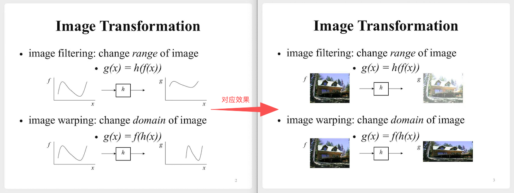

# 图像变换（transformation）

分别介绍下这两种变换：

# 一、图像变形（warping）

## 1.1 线性变换（linear）
1. 变换大小
$$
\begin{aligned}
    \begin{pmatrix}
        x' \\
        y' \\
    \end{pmatrix} = 
    \begin{pmatrix}
        s & 0 \\
        0 & s \\
    \end{pmatrix}
    \begin{pmatrix}
        x \\
        y \\
    \end{pmatrix}
\end{aligned}
$$
2. 逆时针旋转
$$
\begin{aligned}
    \begin{pmatrix}
        x' \\
        y' \\
    \end{pmatrix} = 
    \begin{pmatrix}
        \cos \theta & - \sin \theta \\
        \sin \theta & cos \theta \\
    \end{pmatrix}
    \begin{pmatrix}
        x \\
        y \\
    \end{pmatrix}
\end{aligned}
$$
3. 关于y轴对称
$$
\begin{aligned}
    \begin{pmatrix}
        x' \\
        y' \\
    \end{pmatrix} = 
    \begin{pmatrix}
        -1 & 0 \\
        0 & 1 \\
    \end{pmatrix}
    \begin{pmatrix}
        x \\
        y \\
    \end{pmatrix}
\end{aligned}
$$

## 1.2 仿射变换（affine）
- 平移
$$
\begin{aligned}
    \begin{pmatrix}
        x' \\
        y' \\
        1
    \end{pmatrix} = 
    \begin{pmatrix}
        1 & 0 & t_x \\
        0 & 1 & t_y \\
        0 & 0 & 1
    \end{pmatrix}
    \begin{pmatrix}
        x \\
        y \\
        1
    \end{pmatrix} =
    \begin{pmatrix}
        x+t_x \\
        y+t_y \\
        1
    \end{pmatrix}
\end{aligned}
$$
- 任何一个这样的矩阵，都是在做仿射变换：
$$
\begin{aligned}
    \begin{pmatrix}
        a & b & c \\
        d & e & f \\
        0 & 0 & 1
    \end{pmatrix}
\end{aligned}
$$
- 1.1中的**线性变换**，也都是仿射变换

## 1.3 投影变换（projective）
更进一步，如果是这样的矩阵，就是在做投影变换：
$$
\begin{aligned}
    \begin{pmatrix}
        a & b & c \\
        d & e & f \\
        g & h & 1
    \end{pmatrix}
\end{aligned}
$$

# 二、图像滤波（filtering）

- todo
