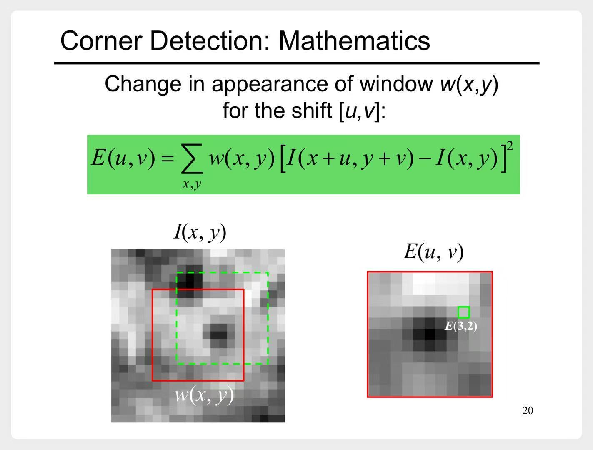
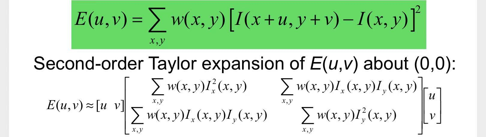

# 特征检测与匹配

- 图像特征匹配，分为这4步
    1. 特征检测
    2. 特征描述
    3. 特征匹配
    4. 特征对应

---

# 一、 特征检测

一个好的特征，需要有4个特性：
1. 可重复性
    - 图像经过几何变换、光学变换等，还可以找到
2. 显著性
    - 可区分
3. 高效性
    - 特征的数量要比图像像素少很多
4. 本地性
    - 基于图像中一小块区域就可以计算

## 1.1 角点检测（corners）

### 1.1.1 推导过程

1. 定义一个函数E(u,v)，来衡量当窗口偏移时，图像的变化程度

    

    
<b>示意图</b>

    
    > E(3,2)表示从红框到绿框，图像的变化程度

    

2. E(u,v)是一个二元函数，在(0,0)处对其二阶泰勒展开

    

3. 中间这个大矩阵，记为M。我们将它简写为：
$$
M = 
\begin{bmatrix}
\sum I_x I_x & \sum I_x I_y \\
\sum I_x I_y & \sum I_y I_y 
\end{bmatrix}
$$

4. 接下来重点分析**M矩阵**
    1. 如果图像在水平方向没有变化，$I_x=0$，此时**M矩阵**只有一个特征值$\lambda$
    2. 如果图像在竖直方向没有变化，$I_y=0$，此时**M矩阵**只有一个特征值$\lambda$
    3. 对**M矩阵**进行特征值分解：
        $$
        M = W 
        \begin{bmatrix}
        \lambda_1 & 0 \\
        0 & \lambda_2 
        \end{bmatrix}
        W^{-1}
        $$
        - 与前两种情况类似，有这样的结论：
            ||是否为角点|
            |---|---|
            |$\lambda_2 >> \lambda_1$|水平方向没有明显变化|
            |$\lambda_2 << \lambda_1$|竖直方向没有明显变化|
            |$\lambda_2、\lambda_1$都很小|都没有明显变化|
            |$\lambda_2、\lambda_1$都比较大|`yes`|
    4. 于是定义了一个响应函数来区分这几种情况：
        $$
        R = det(M) - \alpha \ trace(M)^2 = \lambda_1 \lambda_2 - \alpha (\lambda_1 + \lambda_2)^2 \qquad \alpha通常为 0.04至0.06
        $$
        - 再补充一下上面这张表格：
            ||$R$|是否为角点|
            |---|---|---|
            |$\lambda_2 >> \lambda_1$|$R<0$|水平方向没有明显变化|
            |$\lambda_2 << \lambda_1$|$R<0$|竖直方向没有明显变化|
            |$\lambda_2、\lambda_1$都很小|$R \approx 0$|都没有明显变化|
            |$\lambda_2、\lambda_1$都比较大|$R>0$|`yes`|

### 1.1.2 检测流程

- 上一节分析了这么多，最后得出一个非常简单的检查流程：
    1. 对图像中的每个小区域（window）计算**M矩阵**，并计算**响应函数R**
    2. **响应函数R**较大的，即为**角点**
    3. 当然由于这些**角点**可能重叠，最后需要进行**非极大值抑制**
        - 最后的**非极大值抑制**，课程中没介绍。了解`YOLO`检测的同学应该比较熟悉..

### 1.1.3 invariance

1. 图片平移、旋转，**角点检测**仍然有效
2. 图片大小改变，**角点检测**就失效了

## 1.2 Scale-space blobs

- todo