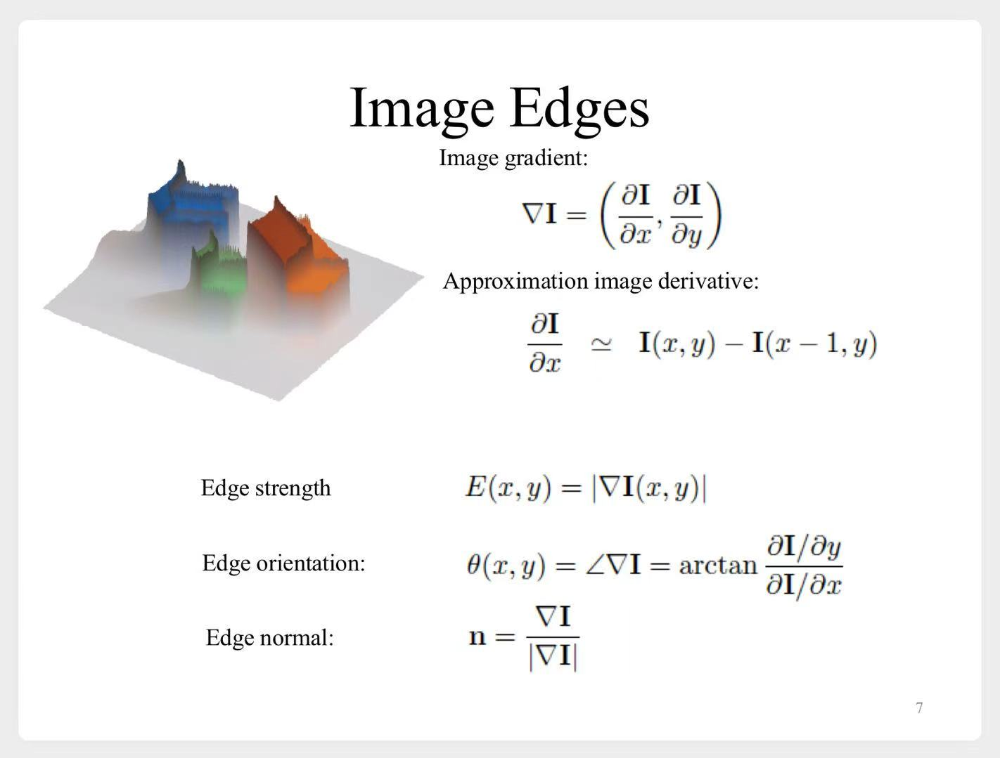
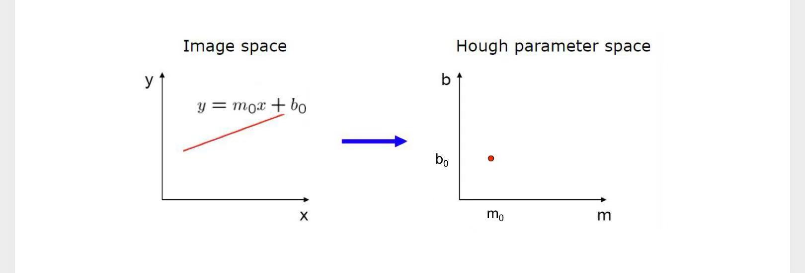
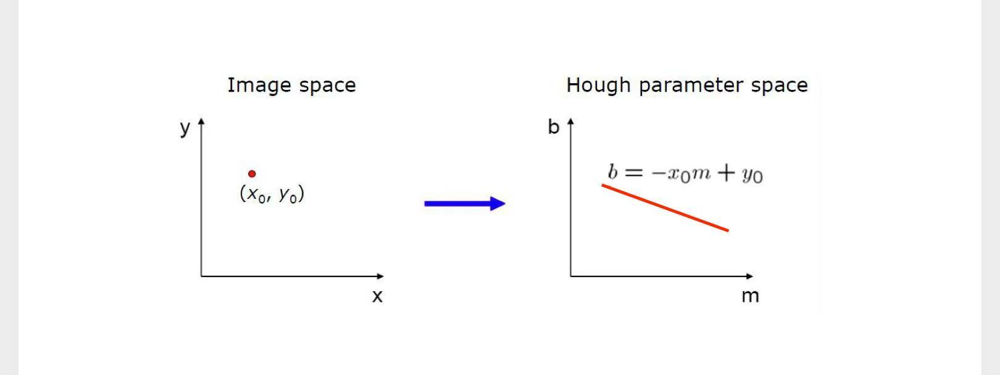
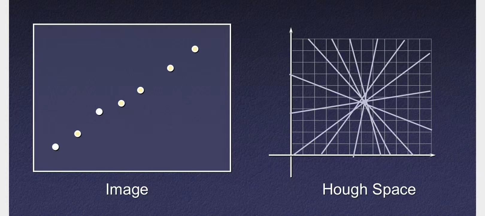
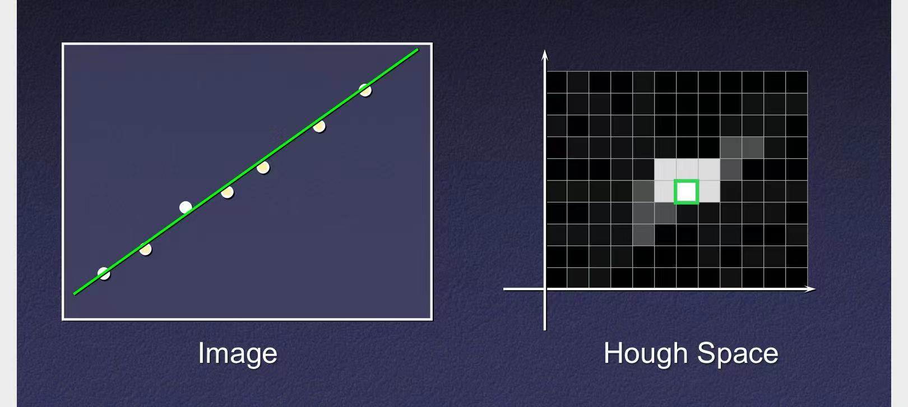

# 边缘和线特征检测

# 一、边缘检测

## 1.1 基本概念

学习**SIFT**时也遇到过了。再介绍一下这几个概念：

1. 图像梯度
2. 边缘强度
3. 边缘方向
4. 边缘法向量

计算公式

## 1.2 Canny边缘检测

### 1.2.1 预备知识

1. 这三者是等价的
    1. 先求图像梯度，再滤波
    2. 先滤波，再求图像梯度
    3. 先求滤波器的梯度，再滤波
    - 公式表示如下：
    $$
    \frac {df} {dx} * g = \frac d {dx} (f*g) = f * \frac {dg} {dx}
    $$
2. 二维高斯分布，等价于两个一维高斯分布的乘积
    $$
    G_2(x,y) = G_1(x)G_1(y)
    $$
3. 求图像梯度，往往先用高斯滤波器做平滑，再求导

    - 可以用这个公式来加速计算：
        $$
        \nabla (f(x,y) * G_2(x,y)) =
            \begin{bmatrix}
            f(x,y) * G_1'(x) * G_1(y) \\
            f(x,y) * G_1(x) * G_1'(y) \\
            \end{bmatrix}
        $$

        

        
详细推导

        $$
        \begin{aligned}
        \nabla (f(x,y) * G_2(x,y))
        &=  \begin{bmatrix}
            \frac {\partial [f(x,y) * G_2(x,y)]} {\partial x} \\
            \frac {\partial [f(x,y) * G_2(x,y)]} {\partial y} \\
            \end{bmatrix} & 先滤波，再求导 \\
        \\
        &=  \begin{bmatrix}
            f(x,y) * \frac {\partial G_2(x,y)} {\partial x} \\
            f(x,y) * \frac {\partial G_2(x,y)} {\partial y} \\
            \end{bmatrix} & 先对滤波器求导，再滤波 \\
        \\
        &=  \begin{bmatrix}
            f(x,y) * \frac {\partial G_1(x)G_1(y)} {\partial x} \\
            f(x,y) * \frac {\partial G_1(x)G_1(y)} {\partial y} \\
            \end{bmatrix} & 拆分为两个一维高斯 \\
        \\
        &=  \begin{bmatrix}
            f(x,y) * \left[ \frac {\partial G_1(x)} {\partial x} G_1(y) \right] \\
            \\
            f(x,y) * \left[ G_1(x) \frac {\partial G_1(y)} {\partial y} \right] \\
            \end{bmatrix} \\
        \\
        &=  \begin{bmatrix}
            f(x,y) * \left[ G_1'(x) G_1(y) \right] \\
            f(x,y) * \left[ G_1(x) G_1'(y) \right] \\
            \end{bmatrix} \\
        \\
        &=  \begin{bmatrix}
            f(x,y) * G_1'(x) * G_1(y) \\
            f(x,y) * G_1(x) * G_1'(y) \\
            \end{bmatrix} & 二维滤波，拆分为两个一维滤波 \\
        \\
        \end{aligned}
        $$

        
 

### 1.2.2 检测流程

1. 用“**高斯导数滤波器**”，即$G'(x)$对图像滤波
2. 计算**边缘强度**、**边缘方向**
3. **非极大值抑制**
    - 只保留局部极大值，“细化”边缘
4. 滞后阈值
    - 双阈值法，识别和连接真正的边缘

# 二、线特征检测

经过**边缘检测**，获得了一系列**边缘点**。那么如何确定哪些**边缘点**在一条线上呢？

## 2.1 RANSAC

> 略

## 2.2 霍夫变换

### 2.2.1 基本思想

将图像空间中的线转换到参数空间进行投票

### 2.2.2 直角坐标系中

1. 图像中的一条直线，对应霍夫空间的一个点

2. 图像中的一个点，对应霍夫空间的一条线

3. 将霍夫空间离散化（画出网格）。然后画出图像中的每个点，对应到霍夫空间的直线

4. 累积投票。票数最多的网格（转换成点），即可对应出图像中的一条直线

### 2.2.3 极坐标系中